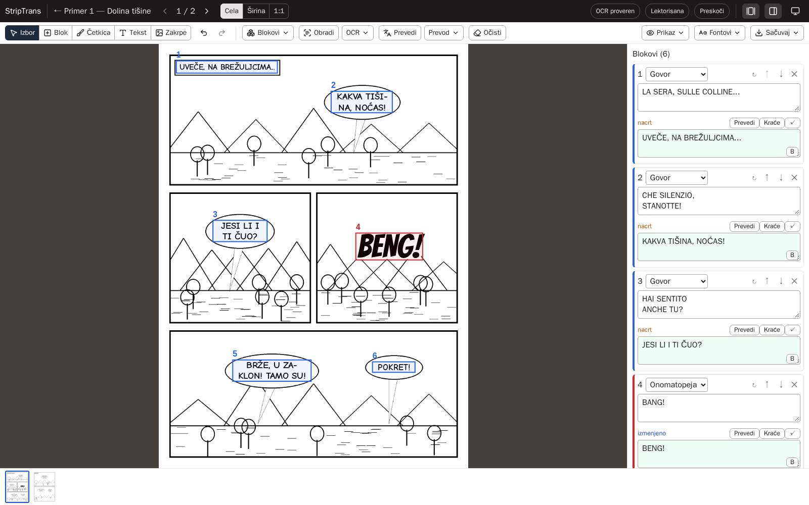
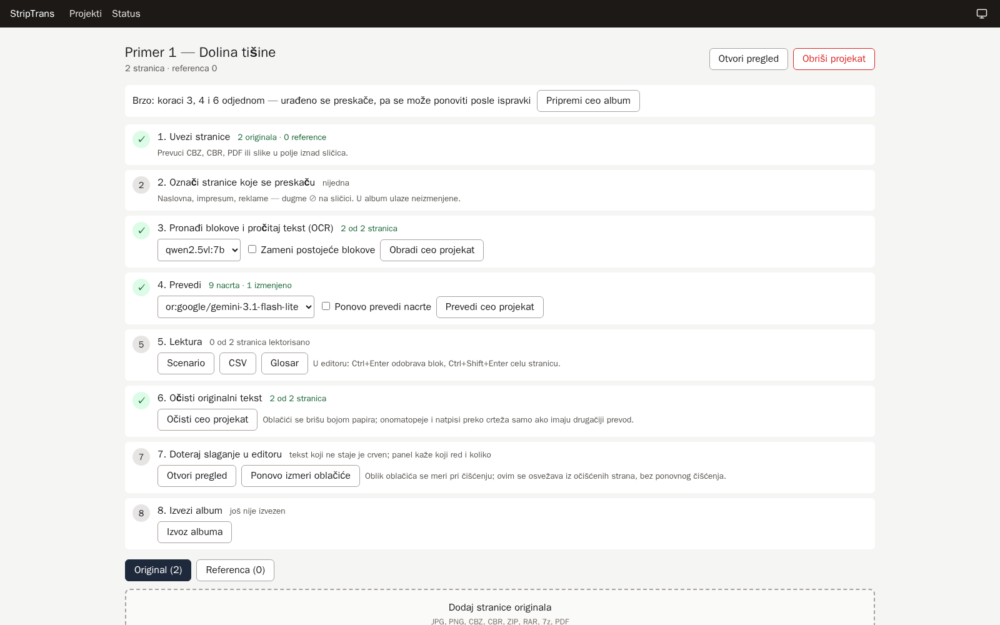

# StripTrans

Alat za prevod stripova sa italijanskog na srpski, od skena do gotovog albuma: pronađe oblačiće, pročita tekst,
prevede ga, obriše original i složi prevod rukom pisanim slovima, pa izveze CBZ ili PDF. Pravljen je za klasične
italijanske crno-bele stripove (paneli, oblačići, ručni lettering velikim slovima).

*English summary below.*



## Šta ume

- **Uvoz:** CBZ, CBR, ZIP, RAR, 7z, PDF i slike, bez gubitka kvaliteta; preskakanje strana (naslovna, reklame).
- **Detekcija i OCR:** oblačići, naracija, natpisi i onomatopeje; redosled čitanja po panelima; OCR modelom
  Qwen2.5-VL na sopstvenoj grafičkoj kartici, preko llama-servera ili Ollame (aplikacija sama koristi onaj koji je
  instaliran); prepoznavanje naglaska (povik, podebljane reči).
- **Prevod:** cela strana odjednom uz kontekst, glosar ustaljenih izraza i memoriju prevoda, preko OpenRouter-a
  (npr. gemini-3.1-flash-lite, oko 0,05 $ po broju); srpski ekavski, samo latinica. **Stilovi prevoda** u
  podešavanjima (više sačuvanih, jedan aktivan) i uputstvo za prevod po serijalu (likovi, uzrečice); probni prevod
  bloka pre upisa; napomena prevodioca za igru reči. Tekst prelomljen u više kolona ili oblačića prevodi se u jednom
  komadu.
- **Onomatopeje:** zajednički glosar onomatopeja; reči van glosara ostaju kao u originalu, osim onih sa SH i W
  (CRASH → KRAŠ), koje se nude kao predlog; „Prekrij original" umesto brisanja preko crteža.
- **Lektura:** pravopis, upozorenja (glosar, dužina, hrvatske i ijekavske reči, naglasak), scenario za lektora.
- **Čišćenje:** oblačići bojom papira, natpisi preko crteža big-lama modelom, četkica za ručne popravke (i za
  brisanje delova zakrpe).
- **Slova:** slaganje po obliku oblačića sa srpskim rastavljanjem, sopstveni fontovi, naglasak i kurziv;
  naslovi od slova originala; AI prepravka natpisa i onomatopeja: automatski preko modela za slike (plaća se po
  pozivu, 0,03–0,07 $) ili ručno preko AI aplikacije koju već koristiš (npr. Gemini), bez troška po slici: isečak i
  uputstvo idu u clipboard, a vraćena slika se nalepi u editor (Ctrl+V) i postaje zakrpa na mestu natpisa.
- **Editor:** zakrpe slikom, pomeranje strelicama (1 px, Shift 10 px), Poništi/Ponovi, traka sličica sa brojevima.
- **Izvoz:** CBZ, PDF ili ZIP; red poslova sa napretkom.

Merenja na stvarnim stranama: na probnom skupu od 12 strana detekcija nađe sve blokove, a OCR greši u 0,17 %
znakova; prevod je u slepom poređenju ocenjen 4,5 od 5; ceo broj od 100 strana se pročita za oko pola sata, a
prevede za oko 3 minuta.



## Šta je potrebno

- Windows 10/11 sa WSL2 i Docker Desktop-om (ili Linux sa Docker-om);
- grafička kartica za OCR; model zauzima oko 7 GB memorije kartice. Testirano na AMD RX 6800 (16 GB);
  NVIDIA kartice rade sa CUDA ili Vulkan izdanjem llama.cpp-a, odnosno sa Ollamom (nije testirano);
- **llama-server** (llama.cpp, brži) **ili Ollama** (jednostavnija instalacija, OCR ~2× sporiji);
- OpenRouter nalog sa malo kredita za prevod;
- oko 15 GB prostora (modeli, Docker slike).

## Instalacija, ukratko

```bash
git clone https://github.com/denis011/striptrans.git && cd striptrans
cp .env.example .env        # upiši OPENROUTER_API_KEY
make models                 # modeli za detekciju i brisanje teksta (~0,5 GB)
make llm-models             # OCR model za llama-server (~6 GB)
make up                     # pokreće llama-server i aplikaciju: http://localhost:5173
```

Za llama-server treba ručno raspakovati Windows izdanje llama.cpp-a (Vulkan za AMD, CUDA ili Vulkan za NVIDIA).
Umesto njega može Ollama: instaliraj je sa ollama.com, pa `ollama pull qwen2.5vl:7b` — `make up` sam prepoznaje
koji je server instaliran (ako su oba, koristi llama-server). Sve korake, podešavanja i rad u
aplikaciji opisuje [docs/UPUTSTVO.md](docs/UPUTSTVO.md).

## Važno

- **Prevodi samo stripove koje poseduješ, za ličnu upotrebu.** Skenovi, prevodi i fontovi napravljeni od tuđih
  izdanja podležu autorskim pravima njihovih vlasnika; za to je odgovoran korisnik.
- StripTrans nije povezan ni sa jednim izdavačem stripova.
- Tekst za prevod ide na OpenRouter (i do izabranog modela); sve ostalo radi lokalno.
- **Aplikacija nema prijavu i namenjena je samo za tvoj računar.** Portovi su vezani za `127.0.0.1`
  (http://localhost:5173); ne izlaži je mreži ni internetu.

## Licenca

[PolyForm Noncommercial 1.0.0](LICENSE.md): kod je javan i sme se koristiti, menjati i deliti za **nekomercijalne**
svrhe (lična upotreba, hobi, istraživanje, obrazovanje). Komercijalna upotreba i prodaja nisu dozvoljene bez
dozvole autora. Tuđe biblioteke, fontovi i modeli imaju svoje licence — vidi [NOTICE.md](NOTICE.md).
Izmene koda (pull request-ovi) se za sada ne primaju — vidi [CONTRIBUTING.md](CONTRIBUTING.md).

---

## English

StripTrans translates comics from Italian into Serbian, from scan to finished album: it detects balloons, reads
the text (Qwen2.5-VL on your own GPU via llama-server or Ollama, whichever is installed), translates whole pages with context, glossary and
translation memory (via OpenRouter; saved translation styles and per-series notes; text split over several columns
is translated as one piece), erases the original lettering, letters the translation with a hand-lettering font
fitted to the balloon shape, and exports CBZ or PDF. Titles and sound effects over artwork can be redrawn by an image
model (paid per call) or by hand in an AI app you already use (crop and prompt go to the clipboard, the returned
image is pasted back as a patch). It was built for classic Italian black-and-white
comics (panels, balloons, uppercase hand lettering). The interface and documentation are in Serbian.

Requirements: Windows with WSL2 and Docker Desktop (or Linux with Docker), a GPU for OCR (the model needs about
7 GB of GPU memory; tested on an AMD RX 6800 with 16 GB; NVIDIA should work with the CUDA or Vulkan build of
llama.cpp or with Ollama, untested), llama-server or Ollama, and an OpenRouter account for translation. Setup: see the commands above and
[docs/UPUTSTVO.md](docs/UPUTSTVO.md).

**Only translate comics you own, for personal use.** StripTrans is not affiliated with any comic publisher.
The app has no login and is meant for your own computer only: ports are bound to `127.0.0.1`; do not expose it to a
network.

License: [PolyForm Noncommercial 1.0.0](LICENSE.md) — free for noncommercial use; commercial use requires the
author's permission. Third-party components: [NOTICE.md](NOTICE.md). Pull requests are not accepted for now.
